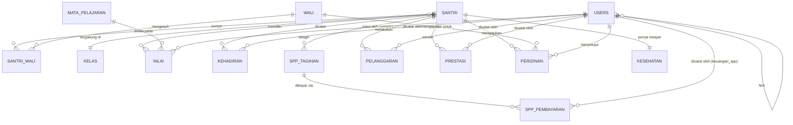

## Catatan status

Tidak ada PRD/SRS yang mendahului dokumen ini — hanya daftar modul dan
peran dari percakapan. Enam pertanyaan yang saya ajukan sebelumnya
**belum dijawab**; skema di bawah mengisi kekosongan itu dengan asumsi
eksplisit (lihat bagian *Assumptions*). Ini draf v0.1 untuk didiskusikan,
bukan skema final — jangan langsung dieksekusi ke Postgres produksi.

## Executive Summary

Skema relasional (PostgreSQL, konsisten dengan stack `dataku2026` —
Supabase + RLS) untuk 7 modul: Data Induk Santri, Nilai, Kehadiran,
SPP, Pelanggaran & Prestasi, Perizinan, Kesehatan. 4 peran: `admin`,
`ustadz`, `keuangan_spp`, `wali`; santri sendiri diasumsikan TIDAK
punya akun login terpisah di v0.1 (lihat Assumptions #1).

## Entity List

1. `santri` — data induk santri
2. `wali` — data wali/orang tua (bisa 1 wali punya banyak santri)
3. `santri_wali` — relasi many-to-many santri ↔ wali
4. `users` — akun login (admin, ustadz, keuangan_spp, wali)
5. `kelas` — rombongan belajar / kelas
6. `mata_pelajaran` — daftar mapel
7. `nilai` — nilai santri per mapel per semester
8. `kehadiran` — presensi harian santri
9. `spp_tagihan` — tagihan SPP per santri per periode
10. `spp_pembayaran` — pembayaran atas tagihan
11. `pelanggaran` — catatan pelanggaran (gradasi poin)
12. `prestasi` — catatan prestasi (akademik/non-akademik)
13. `perizinan` — pengajuan izin/cuti santri
14. `kesehatan` — riwayat kesehatan santri (data sensitif)

## Entity-Relationship Diagram

## Schema Definitions

### `users`
| Kolom | Tipe | Constraint |
|---|---|---|
| id | uuid | PK, default gen_random_uuid() |
| email | text | UNIQUE, NOT NULL |
| role | text | NOT NULL, CHECK IN ('admin','ustadz','keuangan_spp','wali') |
| nama_lengkap | text | NOT NULL |
| wali_id | uuid | FK -> wali.id, NULL kecuali role='wali' |
| created_at | timestamptz | default now() |

### `santri`
| Kolom | Tipe | Constraint |
|---|---|---|
| id | uuid | PK |
| nis | text | UNIQUE, NOT NULL (nomor induk santri) |
| nama_lengkap | text | NOT NULL |
| tanggal_lahir | date | |
| jenis_kelamin | text | CHECK IN ('L','P') |
| kelas_id | uuid | FK -> kelas.id |
| status | text | CHECK IN ('aktif','lulus','keluar','pindah'), default 'aktif' |
| tanggal_masuk | date | NOT NULL |
| created_at | timestamptz | default now() |

### `wali`
| Kolom | Tipe | Constraint |
|---|---|---|
| id | uuid | PK |
| nama_lengkap | text | NOT NULL |
| no_telepon | text | |
| hubungan | text | CHECK IN ('ayah','ibu','wali_lain') |

### `santri_wali` (junction, lihat Assumptions #2)
| Kolom | Tipe | Constraint |
|---|---|---|
| santri_id | uuid | FK -> santri.id |
| wali_id | uuid | FK -> wali.id |
| PK | | (santri_id, wali_id) |

### `kelas`
| Kolom | Tipe | Constraint |
|---|---|---|
| id | uuid | PK |
| nama_kelas | text | NOT NULL |
| tahun_ajaran | text | NOT NULL, mis. '2026/2027' |
| wali_kelas_id | uuid | FK -> users.id (role ustadz) |

### `mata_pelajaran`
| Kolom | Tipe | Constraint |
|---|---|---|
| id | uuid | PK |
| nama_mapel | text | NOT NULL |

### `nilai` (lihat Assumptions #3)
| Kolom | Tipe | Constraint |
|---|---|---|
| id | uuid | PK |
| santri_id | uuid | FK -> santri.id |
| mata_pelajaran_id | uuid | FK -> mata_pelajaran.id |
| semester | text | CHECK IN ('ganjil','genap') |
| tahun_ajaran | text | NOT NULL |
| nilai_angka | numeric(5,2) | CHECK 0-100 |
| predikat | text | nullable, mis. 'A','B','C' |
| catatan | text | nullable |
| input_oleh | uuid | FK -> users.id |
| UNIQUE | | (santri_id, mata_pelajaran_id, semester, tahun_ajaran) |

### `kehadiran`
| Kolom | Tipe | Constraint |
|---|---|---|
| id | uuid | PK |
| santri_id | uuid | FK -> santri.id |
| tanggal | date | NOT NULL |
| status | text | CHECK IN ('hadir','sakit','izin','alpa') |
| dicatat_oleh | uuid | FK -> users.id |
| UNIQUE | | (santri_id, tanggal) |

### `spp_tagihan` (lihat Assumptions #4)
| Kolom | Tipe | Constraint |
|---|---|---|
| id | uuid | PK |
| santri_id | uuid | FK -> santri.id |
| periode | text | NOT NULL, mis. '2026-09' |
| jenis | text | CHECK IN ('spp_bulanan','uang_gedung','seragam','lainnya') |
| jumlah | numeric(12,2) | NOT NULL |
| jatuh_tempo | date | |
| status | text | CHECK IN ('belum_bayar','lunas','sebagian'), default 'belum_bayar' |

### `spp_pembayaran`
| Kolom | Tipe | Constraint |
|---|---|---|
| id | uuid | PK |
| tagihan_id | uuid | FK -> spp_tagihan.id |
| jumlah_dibayar | numeric(12,2) | NOT NULL |
| tanggal_bayar | timestamptz | default now() |
| metode | text | CHECK IN ('tunai','transfer','lainnya') |
| dicatat_oleh | uuid | FK -> users.id (role keuangan_spp) |

### `pelanggaran` (lihat Assumptions #5)
| Kolom | Tipe | Constraint |
|---|---|---|
| id | uuid | PK |
| santri_id | uuid | FK -> santri.id |
| tanggal | date | NOT NULL |
| kategori | text | CHECK IN ('teguran_lisan','teguran_tertulis','sp1','sp2','sp3') |
| poin | integer | NOT NULL |
| deskripsi | text | |
| dicatat_oleh | uuid | FK -> users.id |

### `prestasi`
| Kolom | Tipe | Constraint |
|---|---|---|
| id | uuid | PK |
| santri_id | uuid | FK -> santri.id |
| tanggal | date | NOT NULL |
| kategori | text | CHECK IN ('akademik','non_akademik') |
| deskripsi | text | NOT NULL |
| tingkat | text | nullable, mis. 'sekolah','kabupaten','provinsi','nasional' |
| dicatat_oleh | uuid | FK -> users.id |

### `perizinan`
| Kolom | Tipe | Constraint |
|---|---|---|
| id | uuid | PK |
| santri_id | uuid | FK -> santri.id |
| diajukan_oleh | uuid | FK -> wali.id |
| jenis | text | CHECK IN ('pulang','sakit','keperluan_lain') |
| tanggal_mulai | date | NOT NULL |
| tanggal_selesai | date | NOT NULL |
| alasan | text | |
| status | text | CHECK IN ('menunggu','disetujui','ditolak'), default 'menunggu' |
| disetujui_oleh | uuid | FK -> users.id, nullable |

### `kesehatan` (lihat Assumptions #6 — data sensitif)
| Kolom | Tipe | Constraint |
|---|---|---|
| santri_id | uuid | PK, FK -> santri.id |
| golongan_darah | text | nullable |
| alergi | text | nullable |
| riwayat_penyakit | text | nullable |
| kontak_darurat | text | nullable |
| updated_at | timestamptz | default now() |
| updated_oleh | uuid | FK -> users.id |

## Indexing Strategy

- `santri(nis)`, `santri(kelas_id)`, `santri(status)`
- `nilai(santri_id, tahun_ajaran, semester)`
- `kehadiran(santri_id, tanggal)` — query harian per santri paling sering
- `spp_tagihan(santri_id, status)` — untuk daftar tunggakan
- `pelanggaran(santri_id)`, `prestasi(santri_id)`
- `perizinan(status)` — untuk antrean approval

## Migration Strategy

Ikuti pola `dataku2026`: file bernomor di `supabase/migrations/`,
satu migrasi = satu perubahan logis, dijalankan manual oleh tim
Supabase (bukan auto-apply). RLS policy ditulis di migrasi yang sama
dengan tabelnya, bukan menyusul belakangan — mengulang gap
"mock tidak mencerminkan RLS asli" di `dataku2026` adalah risiko yang
sudah diketahui dan harus dihindari sejak migrasi pertama.

## Data Integrity Rules

- Semua FK `ON DELETE RESTRICT` kecuali `santri_wali` (`ON DELETE CASCADE` dari sisi wali/santri yang dihapus).
- `nilai`, `kehadiran` pakai UNIQUE constraint gabungan untuk cegah duplikat entri per santri per periode.
- RLS wajib: `wali` hanya baca baris milik santri yang terhubung lewat `santri_wali`; `ustadz` hanya CRUD `nilai`/`kehadiran` untuk `kelas_id` yang diampu; `kesehatan` hanya diakses `admin` + wali santri bersangkutan (ustadz TIDAK otomatis punya akses, beda dari asumsi tabel peran di pesan sebelumnya — lihat Assumptions #6).

## Keputusan terkonfirmasi (2026-09-02, bertahap)

1. **Santri tidak login sendiri** — CONFIRMED. Semua akses data santri lewat akun `wali`.
2. **Kesehatan dibatasi admin + wali santri bersangkutan saja** (ustadz tidak punya akses default) — CONFIRMED.
3. **SPP dicatat manual**, tanpa integrasi payment gateway — CONFIRMED.
4. **Wali bersifat optional per santri** — CONFIRMED. `santri_wali` tetap junction table terpisah (santri boleh punya 0 baris di sana), tidak ada perubahan skema. Konsekuensi: `perizinan.diajukan_oleh` tetap NOT NULL FK ke `wali.id` — **santri tanpa data wali tidak bisa punya proses perizinan sampai wali diisi** (aturan bisnis yang disengaja, bukan bug).
5. `santri` + `wali` + `santri_wali` — **FINAL untuk v1.0**, siap ditulis jadi migrasi SQL.

## Assumptions tersisa (belum dikonfirmasi — masih tebakan, perlu direview per modul saat digarap)

1. **Satu wali bisa punya banyak santri** (kakak-adik) — sudah diakomodasi lewat `santri_wali` many-to-many, belum eksplisit dikonfirmasi tapi konsisten dengan desain junction table.
2. **Nilai berupa angka + predikat per mapel per semester**, tanpa komponen nilai granular (UH/UTS/UAS terpisah). Kalau butuh breakdown, `nilai` perlu tabel anak `nilai_komponen`.
3. **Pelanggaran pakai gradasi mirip sistem lama** (Teguran Lisan → SP-3) — kalau DIS mau sistem poin akumulatif yang beda, kolom `poin` + `kategori` perlu didesain ulang.
4. **`kelas_id` di `santri` = satu kelas tetap per tahun ajaran**, tanpa riwayat perpindahan kelas — perlu dikonfirmasi sebelum migrasi Kehadiran/Nilai (keduanya bergantung pada `kelas_id` saat ini).
5. **Tidak ada kolom alamat/domisili** di `santri`/`wali` — relevan untuk modul Perizinan (verifikasi izin pulang), belum diputuskan.

## Dependencies

- Belum ada PRD/SRS formal — dokumen ini seharusnya di-review balik begitu PRD dibuat.
- Bergantung pada keputusan: Supabase project baru untuk DIS, atau reuse project `sjpsexkdllnlxbvnnypk` milik `dataku2026`? (Sebaiknya BARU — mencampur data akademik santri dengan data kepegawaian dalam satu project menambah kompleksitas RLS tanpa manfaat jelas.)

## Risks

- 6 asumsi di atas kalau salah akan butuh migrasi ulang skema (mahal setelah ada data produksi) — lebih murah dikoreksi sekarang.
- Tidak ada PRD berarti quality checklist skill ini ("setiap entity dari PRD terwakili") tidak bisa benar-benar diverifikasi — skema ini divalidasi terhadap ringkasan chat, bukan dokumen requirement resmi.

## Next Actions

1. Konfirmasi/koreksi 6 asumsi di atas.
2. Kalau sudah, lanjut ke `api-engineer` untuk kontrak API per modul.
3. Baru setelah itu migrasi SQL nyata ditulis (`supabase/migrations/`) dan skeleton `main.js`/`ui-shell.js`/`auth.js` di `patterns/` bisa mulai direfaktor jadi modul DIS yang benar-benar berfungsi.
