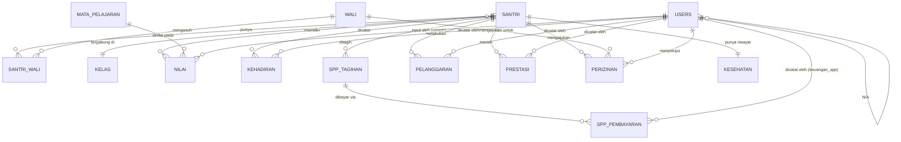

## Catatan status

Tidak ada PRD/SRS yang mendahului dokumen ini — hanya daftar modul dan
peran dari percakapan. Enam pertanyaan yang saya ajukan sebelumnya
**belum dijawab**; skema di bawah mengisi kekosongan itu dengan asumsi
eksplisit (lihat bagian *Assumptions*). Ini draf v0.1 untuk didiskusikan,
bukan skema final — jangan langsung dieksekusi ke Postgres produksi.

## Executive Summary

Skema relasional (PostgreSQL, konsisten dengan stack `dataku2026` —
Supabase + RLS) untuk 7 modul: Data Induk Santri, Nilai, Kehadiran,
SPP, Pelanggaran & Prestasi, Perizinan, Kesehatan. 4 peran: `admin`,
`ustadz`, `keuangan_spp`, `wali`; santri sendiri diasumsikan TIDAK
punya akun login terpisah di v0.1 (lihat Assumptions #1).

## Entity List

1. `santri` — data induk santri
2. `wali` — data wali/orang tua (bisa 1 wali punya banyak santri)
3. `santri_wali` — relasi many-to-many santri ↔ wali
4. `users` — akun login (admin, ustadz, keuangan_spp, wali)
5. `kelas` — rombongan belajar / kelas
6. `mata_pelajaran` — daftar mapel (FINAL, diambil dari blanko_ijazah.xlsm sheet "Leger 2026")
7. `nilai` — nilai santri per mapel per semester (FINAL, schema_004)
8. `kehadiran` — presensi harian santri
9. `spp_tagihan` — tagihan SPP per santri per periode (DRAFT→SQL, schema_005, Tahap 6 — 2 keputusan belum dikonfirmasi, lihat catatan di bawah)
10. `spp_pembayaran` — pembayaran atas tagihan (DRAFT→SQL, schema_005, Tahap 6)
11. `pelanggaran` — catatan pelanggaran (DIREVISI Tahap 10, schema_009: + jenis_pelanggaran + pelapor lintas-HRIS)
11a. `jenis_pelanggaran` — katalog bentuk pelanggaran (baru, schema_009 — kosong, data belum diisi)
12. `prestasi` — catatan prestasi (akademik/non-akademik) (DRAFT→SQL, schema_006, Tahap 7)
13. `perizinan` — pengajuan izin/cuti santri (DRAFT→SQL, schema_007, Tahap 8; ON DELETE direvisi ke RESTRICT di schema_011, Tahap 12)
14. `kesehatan` — profil kesehatan statis santri, data sensitif (DRAFT→SQL, schema_008, Tahap 9)
14a. `kesehatan_riwayat` — rekam medik per-episode (baru, schema_010, Tahap 11 — status ASUMSI belum dikonfirmasi)

## Entity-Relationship Diagram

## Schema Definitions

### `users`
| Kolom | Tipe | Constraint |
|---|---|---|
| id | uuid | PK, default gen_random_uuid() |
| email | text | UNIQUE, NOT NULL |
| role | text | NOT NULL, CHECK IN ('admin','ustadz','keuangan_spp','wali') |
| nama_lengkap | text | NOT NULL |
| wali_id | uuid | FK -> wali.id, NULL kecuali role='wali' |
| created_at | timestamptz | default now() |

### `santri`
| Kolom | Tipe | Constraint |
|---|---|---|
| id | uuid | PK |
| nis | text | UNIQUE, NOT NULL (nomor induk santri) |
| nama_lengkap | text | NOT NULL |
| tanggal_lahir | date | |
| jenis_kelamin | text | CHECK IN ('L','P') |
| ~~kelas_id~~ | — | **DIHAPUS di schema_002** — digantikan `santri_kelas_riwayat` di bawah, karena santri perlu riwayat pindah kelas, bukan satu kelas tetap (CONFIRMED 2026-09-02) |
| status | text | CHECK IN ('aktif','lulus','keluar','pindah'), default 'aktif' |
| tanggal_masuk | date | NOT NULL |
| created_at | timestamptz | default now() |

### `kelas` (revisi schema_002)
| Kolom | Tipe | Constraint |
|---|---|---|
| id | uuid | PK |
| nama_kelas | text | NOT NULL |
| tahun_ajaran | text | NOT NULL |
| wali_kelas_id | uuid | FK -> users.id, belum diaktifkan (users belum ada) |
| UNIQUE | | (nama_kelas, tahun_ajaran) |

### `santri_kelas_riwayat` (baru, schema_002)
| Kolom | Tipe | Constraint |
|---|---|---|
| id | uuid | PK |
| santri_id | uuid | FK -> santri.id |
| kelas_id | uuid | FK -> kelas.id |
| tanggal_mulai | date | NOT NULL |
| tanggal_selesai | date | NULL = penempatan masih aktif |
| EXCLUDE | | rentang tanggal per santri_id tidak boleh tumpang tindih (constraint gist) |

### `wali`
| Kolom | Tipe | Constraint |
|---|---|---|
| id | uuid | PK |
| nama_lengkap | text | NOT NULL |
| no_telepon | text | |
| hubungan | text | CHECK IN ('ayah','ibu','wali_lain') |

### `santri_wali` (junction, lihat Assumptions #2)
| Kolom | Tipe | Constraint |
|---|---|---|
| santri_id | uuid | FK -> santri.id |
| wali_id | uuid | FK -> wali.id |
| PK | | (santri_id, wali_id) |

### `kelas`
| Kolom | Tipe | Constraint |
|---|---|---|
| id | uuid | PK |
| nama_kelas | text | NOT NULL |
| tahun_ajaran | text | NOT NULL, mis. '2026/2027' |
| wali_kelas_id | uuid | FK -> users.id (role ustadz) |

### `mata_pelajaran` (FINAL — sumber: `blanko_ijazah.xlsm`, sheet "Leger 2026", baris header + baris KKM)
| Kolom | Tipe | Constraint |
|---|---|---|
| id | uuid | PK |
| urutan | integer | NOT NULL, UNIQUE (urutan cetak asli 1-39, dipakai supaya urutan di ijazah/transkrip konsisten) |
| nama_mapel | text | NOT NULL, UNIQUE |
| kkm | integer | NOT NULL, CHECK 0-100 |
| kategori | text | CHECK IN ('agama','umum'), nullable — INFERENSI dari pengelompokan KKM di sumber, BUKAN label eksplisit di file. Perlu dikonfirmasi. |

**39 baris seed data** (urutan, nama, KKM):
1-23 KKM 60 (kelompok agama/Arab + Grammar): Al-Qur'an, Bahasa Arab, Imla', Khat, Mahfudhat, Muthalaah, Sharf, Sejarah Kebudayaan Islam, Tajwid, Balaghah, Fiqh, Hadits, Musthalahul Hadits, Nahwu, Tafsir, Tauhid, Ulumul Qur'an, Ushul Fiqh, Fathul Kutub, Kasyful Mu'jam, Tajhiz Mayat, Samadiyah, Grammar.
24 KKM 65: Bahasa Jerman (satu-satunya di luar pola 60/75 — tidak ada penjelasan di file kenapa).
25-39 KKM 75 (kelompok umum): Bahasa Indonesia, Bahasa Inggris, Bahasa Arab (TL), Bahasa Inggris (TL), Biologi, Fisika, Kimia, Ekonomi, Sosiologi, Matematika, PAI, PJOK, PKN, Sejarah, Seni Budaya.

Detail lengkap per baris (SQL seed) ada di `supabase/migrations/`.

### `nilai` (FINAL — schema_004, tanggal 2026-09-02)
| Kolom | Tipe | Constraint |
|---|---|---|
| id | uuid | PK |
| santri_id | uuid | FK -> santri.id |
| mata_pelajaran_id | uuid | FK -> mata_pelajaran.id |
| semester | text | CHECK IN ('ganjil','genap') |
| tahun_ajaran | text | NOT NULL |
| kelas_id | uuid | FK -> kelas.id, snapshot kelas TERBARU santri saat nilai disimpan (CONFIRMED) |
| nilai_angka | numeric(5,2) | CHECK 0-100 |
| predikat | text | nullable, format belum distandarkan (lihat catatan predikat ijazah di bawah) |
| catatan | text | nullable |
| input_oleh | uuid | FK -> users.id, BELUM diaktifkan |
| created_at, updated_at | timestamptz | updated_at auto-update via trigger |
| UNIQUE | | (santri_id, mata_pelajaran_id, semester, tahun_ajaran) |

**Keputusan pindah kelas tengah semester (CONFIRMED 2026-09-02):** nilai dicatat di kelas TERBARU santri, bukan dipecah per kelas lama/baru. `kelas_id` adalah snapshot, diisi aplikasi dari `santri_kelas_riwayat` (baris dengan `tanggal_selesai IS NULL`) saat nilai disimpan — **belum ada validasi level-database** yang memastikan `kelas_id` itu benar-benar salah satu kelas yang pernah/sedang ditempati santri tersebut; ini risiko yang dicatat, bukan disembunyikan.

**Belum dimodelkan**: penugasan ustadz per kelas+mapel (siapa boleh input nilai apa) — menunggu tabel `users`.

### `kehadiran` (revisi schema_002 — kelas_id disimpan langsung per baris, bukan di-derive dari riwayat, supaya rekap historis tetap akurat walau santri pindah kelas)
| Kolom | Tipe | Constraint |
|---|---|---|
| id | uuid | PK |
| santri_id | uuid | FK -> santri.id |
| kelas_id | uuid | FK -> kelas.id (kelas santri SAAT presensi diambil) |
| tanggal | date | NOT NULL |
| status | text | CHECK IN ('hadir','sakit','izin','alpa') |
| dicatat_oleh | uuid | FK -> users.id, belum diaktifkan |
| UNIQUE | | (santri_id, tanggal) |

### `spp_tagihan` (DRAFT → ditulis SQL di schema_005, Tahap 6 — lihat catatan di bawah, BELUM sepenuhnya FINAL)
| Kolom | Tipe | Constraint |
|---|---|---|
| id | uuid | PK |
| santri_id | uuid | FK -> santri.id |
| periode | text | NOT NULL, mis. '2026-09' |
| jenis | text | CHECK IN ('spp_bulanan','uang_gedung','seragam','lainnya') |
| jumlah | numeric(12,2) | NOT NULL |
| jatuh_tempo | date | |
| status | text | CHECK IN ('belum_bayar','lunas','sebagian'), default 'belum_bayar' |

### `spp_pembayaran` (DRAFT → ditulis SQL di schema_005, Tahap 6)
| Kolom | Tipe | Constraint |
|---|---|---|
| id | uuid | PK |
| tagihan_id | uuid | FK -> spp_tagihan.id, **ON DELETE RESTRICT** (bukan CASCADE — lihat catatan di bawah) |
| jumlah_dibayar | numeric(12,2) | NOT NULL, CHECK > 0 |
| tanggal_bayar | timestamptz | default now() |
| metode | text | CHECK IN ('tunai','transfer','lainnya') |
| dicatat_oleh | uuid | FK -> users.id, BELUM diaktifkan |

**Dua keputusan di schema_005 yang BELUM dikonfirmasi pengguna (ditulis eksplisit, jangan dianggap FINAL):**
1. `tagihan_id` pakai `ON DELETE RESTRICT`, bukan `CASCADE` seperti pola FK `santri_id` di tabel lain (`nilai`, `kehadiran`, `santri_wali`) — pilihan saya sendiri supaya tagihan yang sudah punya riwayat pembayaran tidak bisa terhapus diam-diam (jejak audit keuangan). Ini penyimpangan dari konsistensi pola CASCADE yang sudah ada, perlu direview dan dikonfirmasi.
2. `spp_tagihan.status` ('belum_bayar'/'lunas'/'sebagian') **tidak dihitung otomatis** dari total `spp_pembayaran` — tidak ada trigger. Aturan ambang batas (mis. toleransi pembulatan, pembayaran lebih besar dari tagihan) belum didefinisikan di draft manapun.

Migrasi ini **belum dijalankan/diuji ke Postgres asli manapun** — validasi yang dilakukan hanya pengecekan sintaks kasar (keseimbangan tanda kurung), bukan eksekusi nyata.

### `jenis_pelanggaran` (baru, schema_009, Tahap 10)
| Kolom | Tipe | Constraint |
|---|---|---|
| id | uuid | PK |
| nama | text | NOT NULL, UNIQUE |
| deskripsi | text | nullable |
| kategori | text | CHECK IN ('teguran_lisan','teguran_tertulis','sp1','sp2','sp3') |
| poin_default | integer | NOT NULL, CHECK >= 0 |
| aktif | boolean | default true |

**Tabel KOSONG saat migrasi dibuat** — daftar bentuk pelanggaran nyata pesantren (beserta poin) belum diisi. Sengaja tidak dikarang, sama seperti prinsip `mata_pelajaran` yang datanya diambil persis dari sumber asli.

### `pelanggaran` (DIREVISI Tahap 10, schema_009 — menggantikan versi schema_006)
| Kolom | Tipe | Constraint |
|---|---|---|
| id | uuid | PK |
| santri_id | uuid | FK -> santri.id, ON DELETE CASCADE |
| jenis_pelanggaran_id | uuid | FK -> jenis_pelanggaran.id, ON DELETE RESTRICT, NOT NULL |
| tanggal | date | NOT NULL |
| kategori | text | snapshot dari jenis_pelanggaran.kategori saat dicatat |
| poin | integer | snapshot/override dari jenis_pelanggaran.poin_default |
| deskripsi | text | catatan spesifik kejadian ini |
| pelapor_sumber | text | CHECK IN ('dis','hris'), NOT NULL |
| pelapor_nama | text | NOT NULL — snapshot nama pelapor |
| pelapor_dis_user_id | uuid | FK -> users.id (DIS), BELUM diaktifkan |
| pelapor_hris_employee_id | text | referensi LUNAK ke ID pegawai dataku2026 — **TANPA FK asli** |
| dicatat_oleh | uuid | FK -> users.id, BELUM diaktifkan (beda dari pelapor — lihat catatan) |

**Keterbatasan teknis penting (STATUS DIREVISI — lihat schema_015 di bawah):** ~~DIS dan `dataku2026` (HRIS) adalah dua project Supabase terpisah — FK Postgres tidak bisa lintas database. `pelapor_hris_employee_id` karena itu adalah **snapshot**, bukan referensi tervalidasi real-time.~~ **Sejak schema_015 (Tahap 16, CONFIRMED 2026-09-02 "sinkron nyata secara berkala")**: kolom ini sekarang punya **FK sungguhan** ke `pegawai_hris_referensi` (tabel replika lokal, lihat di bawah) — bukan lagi teks bebas tanpa validasi. Database akan menolak ID pegawai yang tidak ada di replika lokal.

**Belum dikonfirmasi:** Assumption #3 lama (gradasi tetap vs poin akumulatif) — struktur di atas mendukung penghitungan poin manual/aplikasi, TAPI tidak ada trigger otomatis SP1→SP2→SP3 dari akumulasi poin karena ambang batasnya belum diberikan.

### `pengaturan_ambang_pelanggaran` (baru, schema_013, Tahap 14 — "setting sistem" Model B, CONFIRMED)
| Kolom | Tipe | Constraint |
|---|---|---|
| id | uuid | PK |
| kategori | text | CHECK IN (5 gradasi), UNIQUE |
| ambang_poin_minimum | integer | NOT NULL, CHECK >= 0 |
| keterangan | text | nullable |
| updated_at | timestamptz | auto-update via trigger |
| diubah_oleh | uuid | FK -> users.id, BELUM diaktifkan |

**Tabel KOSONG saat migrasi dibuat** — angka ambang batas (berapa poin untuk SP1/SP2/SP3) belum diisi, harus diatur pengguna via aplikasi. Fungsi `hitung_status_akumulasi_pelanggaran()` mengembalikan NULL selama tabel ini kosong.

**Fungsi & view pendukung Model B (CONFIRMED 2026-09-02 — "gunakan model B yang dapat dimodifikasi di setting sistem"):**
- `hitung_status_akumulasi_pelanggaran(total_poin integer) → text` — membaca ambang batas dari tabel di atas (bukan hardcode), mengembalikan kategori tertinggi yang tercapai.
- `v_akumulasi_poin_santri` — view real-time: total poin + status akumulasi per santri, dihitung langsung dari `pelanggaran` + pengaturan terkini (bukan kolom cache yang bisa basi).

**Belum dikonfirmasi:** akumulasi bersifat ALL-TIME (tidak direset per tahun ajaran/semester) karena `pelanggaran` tidak punya kolom `tahun_ajaran`. Kalau kebijakan pesantren adalah reset tahunan, perlu revisi struktur tambahan.

**~~Belum dikonfirmasi~~ SELESAI (CONFIRMED 2026-09-02, schema_016, Tahap 17):** akumulasi RESET tiap tahun ajaran. `pelanggaran` bertambah kolom `tahun_ajaran text NOT NULL`. Status disiplin aktif dihitung via fungsi baru `hitung_akumulasi_poin_santri_tahun(tahun_ajaran)`, BUKAN lagi `v_akumulasi_poin_santri` (yang tetap ada tapi sekarang berperan sebagai ringkasan all-time/riwayat menyeluruh saja).

### `pegawai_hris_referensi` (baru, schema_014, Tahap 15 — replika lokal untuk sinkronisasi HRIS, CONFIRMED)
| Kolom | Tipe | Constraint |
|---|---|---|
| hris_employee_id | text | PK — format ID dataku2026, mis. "REG-20260824-4DB8ED" |
| nama_lengkap | text | NOT NULL |
| unit_kerja | text | nullable |
| jabatan | text | nullable |
| status_aktif | boolean | default true — false kalau pegawai resign/pindah, BUKAN dihapus |
| synced_at | timestamptz | default now() |

**Kenapa perlu tabel ini:** DIS dan `dataku2026` tetap dua project Supabase terpisah — Postgres tidak mendukung FK lintas database. Tabel ini adalah **salinan lokal** sebagian data pegawai HRIS, supaya `pelanggaran.pelapor_hris_employee_id` (schema_015) bisa punya FK **sungguhan** ke sini, bukan sekadar teks bebas tanpa validasi seperti sebelumnya (schema_009).

**BELUM SELESAI (di luar cakupan migrasi SQL) — STATUS TAHAP 18 (kode ditulis, belum dideploy):**
1. Job sinkronisasi terjadwal — **kode Edge Function sudah ditulis** di `supabase/functions/sync-pegawai-hris/` (Deno/TypeScript), lengkap dengan README setup untuk tim Supabase. **BELUM dideploy, belum diverifikasi** — nama tabel/kolom sumber di `dataku2026` masih **tebakan** (ditandai eksplisit di kode), perlu dicek terhadap skema asli sebelum deploy.
2. Endpoint di `dataku2026` — job memilih query LANGSUNG ke tabel sumber (bukan lewat RPC `get_team_contacts()`/`search_employee_contacts()` yang sedang bug) via `service_role` key lintas-project. Ini juga berarti kredensial dengan akses penuh ke database HRIS dipegang oleh project DIS — dicatat sebagai risiko keamanan yang perlu dipertimbangkan (lihat README).
3. Setup Cron Trigger via Dashboard Supabase — instruksi lengkap ada di README, wajib tim Supabase.

**Konsekuensi sampai job sinkronisasi berjalan:** tabel ini kosong → semua percobaan mencatat pelanggaran dengan `pelapor_sumber='hris'` akan **ditolak database** (FK constraint violation) — disengaja, bukan bug, supaya tidak diam-diam menyimpan ID pegawai yang tidak tervalidasi.

### `prestasi` (DRAFT→SQL, schema_006, Tahap 7)
| Kolom | Tipe | Constraint |
|---|---|---|
| id | uuid | PK |
| santri_id | uuid | FK -> santri.id, ON DELETE CASCADE |
| tanggal | date | NOT NULL |
| kategori | text | CHECK IN ('akademik','non_akademik') |
| deskripsi | text | NOT NULL |
| tingkat | text | nullable, CHECK IN ('sekolah','kabupaten','provinsi','nasional') |
| dicatat_oleh | uuid | FK -> users.id, BELUM diaktifkan |

**Belum dipetakan:** temuan "Lulus KEMMAS" (hafalan Qur'an/tahfizh) dari `blanko_ijazah.xlsm` (lihat bagian "Temuan tambahan" di bawah) — kemungkinan sub-kategori prestasi yang belum masuk skema ini.

### `perizinan` (DRAFT→SQL, schema_007, Tahap 8 — keputusan ON DELETE belum final)
| Kolom | Tipe | Constraint |
|---|---|---|
| id | uuid | PK |
| santri_id | uuid | FK -> santri.id, ON DELETE CASCADE |
| diajukan_oleh | uuid | FK -> wali.id, NOT NULL, ON DELETE CASCADE |
| jenis | text | CHECK IN ('pulang','sakit','keperluan_lain') |
| tanggal_mulai | date | NOT NULL |
| tanggal_selesai | date | NOT NULL, CHECK >= tanggal_mulai |
| alasan | text | |
| status | text | CHECK IN ('menunggu','disetujui','ditolak'), default 'menunggu' |
| disetujui_oleh | uuid | FK -> users.id, nullable, BELUM diaktifkan |

**`diajukan_oleh` NOT NULL** — konsekuensi dari keputusan CONFIRMED #4 (wali optional per santri): santri tanpa wali tidak bisa punya proses perizinan. Ini disengaja, bukan bug.

**Revisi ON DELETE — sekarang bagian dari kebijakan RESTRICT universal (CONFIRMED 2026-09-02, schema_012):** `santri_id` DAN `diajukan_oleh` sama-sama RESTRICT. Prinsip lama saya (CASCADE untuk santri_id) sudah **digantikan** instruksi eksplisit pengguna — lihat Keputusan #12.

### `kesehatan` (DRAFT→SQL, schema_008, Tahap 9 — data sensitif, PROFIL STATIS)
| Kolom | Tipe | Constraint |
|---|---|---|
| santri_id | uuid | PK, FK -> santri.id, ON DELETE CASCADE |
| golongan_darah | text | nullable |
| alergi | text | nullable |
| riwayat_penyakit | text | nullable |
| kontak_darurat | text | nullable |
| updated_at | timestamptz | default now(), auto-update via trigger |
| updated_oleh | uuid | FK -> users.id, BELUM diaktifkan |

**Akses dibatasi admin + wali santri bersangkutan SAJA** (ustadz TIDAK otomatis punya akses) — CONFIRMED 2026-09-02, keputusan #2.

Tabel ini adalah **profil statis** (1 baris per santri, ditimpa saat update) — untuk riwayat kejadian sakit dari waktu ke waktu, lihat `kesehatan_riwayat` di bawah (Tahap 11, menjawab permintaan "semacam rekam medik").

### `kesehatan_riwayat` (baru, schema_010, Tahap 11 — rekam medik per-episode)
| Kolom | Tipe | Constraint |
|---|---|---|
| id | uuid | PK |
| santri_id | uuid | FK -> santri.id, ON DELETE CASCADE |
| tanggal | date | NOT NULL |
| keluhan | text | NOT NULL — gejala/keluhan/diagnosa awal |
| penanganan | text | nullable — tindakan yang diberikan |
| status | text | CHECK IN ('ditangani','dirujuk','rawat_inap','dalam_pemantauan','sembuh'), default 'ditangani' |
| dicatat_oleh | uuid | FK -> users.id, BELUM diaktifkan |

**DATA SENSITIF**, akses sama seperti `kesehatan` (admin + wali santri bersangkutan saja, ustadz dikecualikan).

**Belum dikonfirmasi:** daftar nilai `status` adalah tebakan saya dari alur umum UKS/klinik sekolah — **bukan** kebijakan Al-Falah yang terverifikasi, perlu dikoreksi.

## Indexing Strategy

- `santri(nis)`, `santri(kelas_id)`, `santri(status)`
- `nilai(santri_id, tahun_ajaran, semester)`
- `kehadiran(santri_id, tanggal)` — query harian per santri paling sering
- `spp_tagihan(santri_id, status)` — untuk daftar tunggakan
- `pelanggaran(santri_id)`, `prestasi(santri_id)`
- `perizinan(status)` — untuk antrean approval

## Migration Strategy

Ikuti pola `dataku2026`: file bernomor di `supabase/migrations/`,
satu migrasi = satu perubahan logis, dijalankan manual oleh tim
Supabase (bukan auto-apply). RLS policy ditulis di migrasi yang sama
dengan tabelnya, bukan menyusul belakangan — mengulang gap
"mock tidak mencerminkan RLS asli" di `dataku2026` adalah risiko yang
sudah diketahui dan harus dihindari sejak migrasi pertama.

## Data Integrity Rules

- Semua FK `ON DELETE RESTRICT` kecuali `santri_wali` (`ON DELETE CASCADE` dari sisi wali/santri yang dihapus).
- `nilai`, `kehadiran` pakai UNIQUE constraint gabungan untuk cegah duplikat entri per santri per periode.
- RLS wajib: `wali` hanya baca baris milik santri yang terhubung lewat `santri_wali`; `ustadz` hanya CRUD `nilai`/`kehadiran` untuk `kelas_id` yang diampu; `kesehatan` hanya diakses `admin` + wali santri bersangkutan (ustadz TIDAK otomatis punya akses, beda dari asumsi tabel peran di pesan sebelumnya — lihat Assumptions #6).

## Keputusan terkonfirmasi (2026-09-02, bertahap)

1. **Santri tidak login sendiri** — CONFIRMED. Semua akses data santri lewat akun `wali`.
2. **Kesehatan dibatasi admin + wali santri bersangkutan saja** (ustadz tidak punya akses default) — CONFIRMED.
3. **SPP dicatat manual**, tanpa integrasi payment gateway — CONFIRMED.
4. **Wali bersifat optional per santri** — CONFIRMED. `santri_wali` tetap junction table terpisah (santri boleh punya 0 baris di sana), tidak ada perubahan skema. Konsekuensi: `perizinan.diajukan_oleh` tetap NOT NULL FK ke `wali.id` — **santri tanpa data wali tidak bisa punya proses perizinan sampai wali diisi** (aturan bisnis yang disengaja, bukan bug).
5. `santri` + `wali` + `santri_wali` — **FINAL untuk v1.0**, ditulis di `schema_001`.
6. **Santri perlu riwayat pindah kelas** (bukan satu kelas tetap per tahun ajaran) — CONFIRMED. Kolom `santri.kelas_id` dari `schema_001` **dihapus** di `schema_002`, digantikan tabel `santri_kelas_riwayat`. `kelas` + `santri_kelas_riwayat` + `kehadiran` — **FINAL untuk v1.0**, ditulis di `schema_002`.
7. **Nilai saat santri pindah kelas tengah semester**: dicatat di kelas TERBARU santri, bukan dipecah per kelas — CONFIRMED. `nilai` — **FINAL untuk v1.0**, ditulis di `schema_004`.
8. **SPP dicatat manual** (keputusan #3 di atas) — `spp_tagihan` + `spp_pembayaran` ditulis SQL di `schema_005` (Tahap 6), TAPI **belum sepenuhnya FINAL**: dua pilihan desain (ON DELETE RESTRICT di `tagihan_id`, dan tidak adanya perhitungan status otomatis) adalah keputusan saya sendiri saat menulis migrasi, bukan hasil konfirmasi eksplisit — perlu direview sebelum dianggap selesai seperti modul lain.
9. **Kesehatan dibatasi admin + wali santri bersangkutan** (keputusan #2 di atas) — `kesehatan` ditulis SQL di `schema_008` (Tahap 9), akses ustadz sengaja dikecualikan sesuai konfirmasi. TAPI struktur "hanya snapshot terkini tanpa riwayat" adalah pembacaan saya atas draft, belum dikonfirmasi eksplisit.
10. **`pelanggaran`, `prestasi`, `perizinan` ditulis SQL** di `schema_006`/`schema_007` (Tahap 7-8) — status DRAFT→SQL, bukan FINAL.
11. **Revisi 2026-09-02 (diskusi lanjutan) — DIREVISI LAGI di poin #12:**
    - ~~`perizinan.diajukan_oleh`: ON DELETE RESTRICT~~ — lihat #12, sekarang bagian dari kebijakan RESTRICT universal.
    - `pelanggaran` DIREVISI (schema_009, Tahap 10): + tabel referensi `jenis_pelanggaran` (katalog bentuk pelanggaran, kosong — data belum diisi) + kolom pelapor lintas-sistem (`pelapor_sumber`, `pelapor_nama`, `pelapor_hris_employee_id` sebagai referensi LUNAK ke HRIS `dataku2026` — TANPA FK asli karena beda project Supabase).
    - `kesehatan_riwayat` ditambahkan (schema_010, Tahap 11) — rekam medik per-episode (keluhan + penanganan + status), melengkapi `kesehatan` yang tetap jadi profil statis. Nilai `status` masih tebakan, belum dikonfirmasi.
12. **RESTRICT universal (CONFIRMED 2026-09-02, schema_012, Tahap 13):** instruksi eksplisit pengguna "gunakan RESTRICT" — SEMUA FK ke `santri.id` di semua tabel diubah dari CASCADE menjadi RESTRICT (kecuali `santri_wali`, tabel relasi murni, tetap CASCADE — pilihan saya sendiri, bisa dikoreksi). **Konsekuensi praktis:** santri yang sudah punya data di tabel manapun TIDAK BISA di-hard-delete — satu-satunya cara "menghapus" santri adalah mengubah kolom `status` (`keluar`/`lulus`/`pindah`). Aplikasi tidak boleh punya tombol hard-delete santri.
13. **Model B poin akumulatif (CONFIRMED 2026-09-02, schema_013, Tahap 14):** instruksi eksplisit pengguna "gunakan model B yang dapat dimodifikasi di setting sistem" — menjawab Assumption #3 lama. Ambang batas poin (kapan status jadi SP1/SP2/SP3) disimpan di tabel `pengaturan_ambang_pelanggaran` yang bisa diubah admin lewat aplikasi, BUKAN hardcode. **Tabel ambang batas sengaja kosong** — angka nyata (berapa poin untuk SP1/2/3) belum diisi, sama prinsip dengan `jenis_pelanggaran`.
14. **Akumulasi RESET tiap tahun ajaran (CONFIRMED 2026-09-02, schema_016, Tahap 17):** instruksi eksplisit "reset tiap tahun". `pelanggaran` bertambah kolom `tahun_ajaran` (wajib diisi aplikasi). Status disiplin AKTIF santri dihitung via `hitung_akumulasi_poin_santri_tahun(tahun_ajaran)` — HANYA poin di tahun ajaran itu. `v_akumulasi_poin_santri` (all-time) tetap ada untuk laporan riwayat menyeluruh, TAPI TIDAK LAGI dipakai untuk status aktif.
15. **Sinkronisasi HRIS nyata (CONFIRMED 2026-09-02, schema_014-015, Tahap 15-16):** instruksi eksplisit "sinkron nyata secara berkala". Dibangun tabel replika lokal `pegawai_hris_referensi` di DIS (disinkron berkala dari `dataku2026`) + FK sungguhan dari `pelanggaran.pelapor_hris_employee_id` ke replika itu (menggantikan referensi lunak tanpa validasi di schema_009). **BELUM SELESAI**: job sinkronisasi terjadwal (Edge Function + Cron Trigger) BELUM dibuat — itu kode aplikasi + setup Dashboard Supabase (wajib tim Supabase), bukan migrasi SQL. Selama tabel replika kosong, pelanggaran dengan `pelapor_sumber='hris'` akan DITOLAK database (disengaja, bukan bug).

## Assumptions tersisa (belum dikonfirmasi — masih tebakan, perlu direview per modul saat digarap)

1. **Satu wali bisa punya banyak santri** (kakak-adik) — sudah diakomodasi lewat `santri_wali` many-to-many, belum eksplisit dikonfirmasi tapi konsisten dengan desain junction table.
2. **Nilai berupa angka + predikat per mapel per semester**, tanpa komponen nilai granular (UH/UTS/UAS terpisah). Kalau butuh breakdown, `nilai` perlu tabel anak `nilai_komponen`.
3. **Pelanggaran pakai gradasi mirip sistem lama** (Teguran Lisan → SP-3) — kalau DIS mau sistem poin akumulatif yang beda, kolom `poin` + `kategori` perlu didesain ulang.
4. ~~`kelas_id` di `santri`...~~ — **SELESAI, lihat keputusan #6 di atas.**
5. **Tidak ada kolom alamat/domisili** di `santri`/`wali` — relevan untuk modul Perizinan (verifikasi izin pulang), belum diputuskan.
6. **Format `kelas.nama_kelas` terkonfirmasi dari `blanko_ijazah.xlsm`**: pola "tingkat-rombel" (mis. "6-A", "6-B") — tapi ini TIDAK menjawab soal riwayat pindah kelas (poin #4), cuma format penamaannya.

## Temuan tambahan dari `blanko_ijazah.xlsm` (belum ditindaklanjuti, dicatat supaya tidak hilang)

- **Entitas `ijazah` belum ada di skema** — Nomor Ijazah, Tanggal Kelulusan, Predikat kelulusan adalah dokumen tersendiri dengan siklus hidup beda dari `nilai` per-mapel. Perlu tabel baru saat modul Nilai/Kelulusan digarap.
- **Predikat kelulusan ternyata 4 tingkat tetap**: ISTIMEWA / SANGAT BAIK / BAIK / CUKUP (dengan padanan Arab) — ini seharusnya jadi CHECK constraint di kolom predikat, bukan teks bebas seperti asumsi awal saya.
- **Predikat & rata-rata di contoh sumber adalah nilai hardcode, bukan hasil formula otomatis** — kalau DIS mau menghitung predikat otomatis dari rata-rata, ambang batas tiap tingkat belum diketahui dari file ini, perlu ditanyakan terpisah.
- **Ada data "Lulus KEMMAS" (hafalan Qur'an)** yang mungkin masuk kategori Prestasi (sub-kategori tahfizh) — belum dipetakan ke skema Pelanggaran & Prestasi.
- **Data historis (sheet "Perkelas", tahun ajaran 2022-2023) pakai skala nilai 0-10**, sementara skema `nilai` saat ini asumsi skala 0-100. Kalau data lama itu perlu diimpor, butuh keputusan normalisasi skala terpisah.

## `users` + Auth (Tahap 19-21, schema_017-019, baru — blocker RLS)

**Status: struktur lengkap, BELUM diuji ke Postgres asli.** Menjawab hampir semua TODO RLS di seluruh dokumen di atas.

### `users` (schema_017)
| Kolom | Tipe | Constraint |
|---|---|---|
| id | uuid | PK, FK -> **auth.users.id** (1:1 dengan akun Supabase Auth, BUKAN uuid baru), ON DELETE CASCADE |
| email | text | NOT NULL, UNIQUE |
| role | text | CHECK IN ('admin','ustadz','keuangan_spp','wali') |
| nama_lengkap | text | NOT NULL |
| wali_id | uuid | FK -> wali.id, ON DELETE RESTRICT — WAJIB diisi kalau role='wali', WAJIB NULL kalau bukan (dijaga CHECK) |
| created_at | timestamptz | default now() |

**Penting:** `users` DIS **terpisah** dari users/auth di `dataku2026` — dua project, dua populasi akun. Pegawai HRIS yang jadi *pelapor* pelanggaran (`pegawai_hris_referensi`) **tidak otomatis** dapat akun login DIS.

Trigger `on_auth_user_created` otomatis membuat baris `public.users` saat akun `auth.users` baru dibuat — **wajib** `raw_user_meta_data` berisi `role` saat signup, kalau tidak insert gagal (disengaja). **Belum diputuskan:** alur pendaftaran akun (admin invite? self-signup?).

**Fungsi helper** (dipakai RLS di seluruh tabel): `current_user_role()`, `current_user_wali_id()`, `is_wali_of_santri(santri_id)` — menggantikan pola placeholder `auth.jwt() ->> 'role'` di semua migrasi sebelumnya.

### FK ke `users.id` diaktifkan (schema_018)
Semua kolom yang sebelumnya "FK BELUM diaktifkan" sekarang punya FK sungguhan, `ON DELETE RESTRICT`. **Konsekuensi berantai:** akun staf yang **pernah** mencatat/menyetujui apa pun tidak bisa dihapus permanen — bahkan hapus `auth.users`-nya akan gagal (CASCADE terblokir RESTRICT di `public.users`). "Nonaktifkan akun" butuh mekanisme lain — **belum ada strukturnya**.

### RLS sungguhan (schema_019)
Policy nyata untuk `wali` (SELECT hanya santri miliknya, semua tabel relevan) dan `keuangan_spp` (CRUD penuh SPP). **Belum lengkap:** kebijakan **ustadz masih sementara** (SELECT umum tanpa batasan kelas) — pembatasan "hanya kelas yang diampu" butuh tabel penugasan ustadz↔kelas/mapel yang **belum ada di skema manapun**. Policy INSERT/UPDATE untuk ustadz juga belum ditulis.

**BELUM DIUJI ke Postgres asli manapun.**

## Dependencies

- Belum ada PRD/SRS formal — dokumen ini seharusnya di-review balik begitu PRD dibuat.
- Bergantung pada keputusan: Supabase project baru untuk DIS, atau reuse project `sjpsexkdllnlxbvnnypk` milik `dataku2026`? (Sebaiknya BARU — mencampur data akademik santri dengan data kepegawaian dalam satu project menambah kompleksitas RLS tanpa manfaat jelas.)

## Risks

- 6 asumsi di atas kalau salah akan butuh migrasi ulang skema (mahal setelah ada data produksi) — lebih murah dikoreksi sekarang.
- Tidak ada PRD berarti quality checklist skill ini ("setiap entity dari PRD terwakili") tidak bisa benar-benar diverifikasi — skema ini divalidasi terhadap ringkasan chat, bukan dokumen requirement resmi.

## Next Actions

**Status per 2026-09-02: 20 migrasi ditulis (schema_001 s/d schema_019, 20 tabel + 1 view + 6 fungsi), + 1 Edge Function (belum dideploy, sengaja ditunda).** Belum satupun migrasi dijalankan/diuji ke Postgres asli manapun.

1. Konfirmasi/koreksi 6 asumsi lama (santri/wali/kelas — sudah lama tertunda).
2. Konfirmasi/koreksi keputusan belum-final di `spp_tagihan`/`spp_pembayaran` (schema_005) — tidak ada trigger status otomatis.
3. **Isi data `jenis_pelanggaran`** (schema_009) — daftar bentuk pelanggaran nyata pesantren beserta gradasi & poin.
4. **Isi angka `pengaturan_ambang_pelanggaran`** (schema_013) — berapa poin untuk SP1/SP2/SP3.
5. **DITUNDA:** deploy job sinkronisasi HRIS — lihat README di `supabase/functions/sync-pegawai-hris/`.
6. **Konfirmasi/koreksi nilai `status`** di `kesehatan_riwayat` (schema_010) — masih tebakan dari alur umum UKS, belum diverifikasi.
7. **Konfirmasi pengecualian `santri_wali`** dari kebijakan RESTRICT universal (schema_012) — keputusan saya sendiri, bisa dikoreksi.
8. **Beri tahu tim pengembang aplikasi**: RESTRICT universal → UI tidak boleh hard-delete santri/wali/user staf. Form pelanggaran wajib `tahun_ajaran`.
9. **Rancang tabel penugasan ustadz↔kelas/mapel** — blocker untuk RLS ustadz yang benar (sekarang masih SELECT umum tanpa batasan kelas, schema_019).
10. **Putuskan alur signup/pendaftaran akun `users`** (schema_017) — siapa boleh membuat akun apa, dan mekanisme nonaktifkan akun (karena hard-delete diblokir RESTRICT).
11. **Uji seluruh RLS ke Postgres asli** — belum pernah diverifikasi sama sekali, ini risiko besar yang sudah berulang kali jadi masalah di proyek dataku2026 (`mockDataService.js` tidak mencerminkan RLS asli).
12. Setelah semua di atas dikonfirmasi/direvisi: lanjut ke `api-engineer` untuk kontrak API per modul.
13. Baru setelah itu skeleton `main.js`/`ui-shell.js`/`auth.js` di `patterns/` bisa mulai direfaktor jadi modul DIS yang benar-benar berfungsi.
